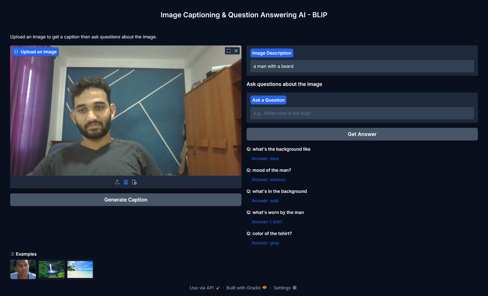

## Image Captioning and Visual Question Answering AI using Hugging Face models 🤗

 

**Built with**

 

An image description and visual question answering AI using hugging face models. Bootstrapping Language-Image Pre-training ( BLIP ) models from Salesforce was chosen as the models and the application was build using Gradio.

We can easily input an image in our own machine or even use the clipboard and the webcam to get the image. This input is then used by the image captioning model to generate a description for the image as to what it's about. The question answering BLIP model then can interactively answer questions regarding the image which gives short answers.

BLIP VQA models are typically trained on datasets like VQA v2.0, where answers are often short and concise (e.g., "yes," "no," "blue," "two"). These datasets favor brief, factual responses over verbose explanations.
The model learns to mimic this pattern, prioritizing succinctness. This is why we get short answers for the questions we ask based on the image. 

just run the app using `python app.py` after installing dependencies and u got yourself a local AI capable of generating descriptions and giving answers to questions about the image. 

---
Made with ❤️ by [Subhanu](https://github.com/subhanu-dev)
